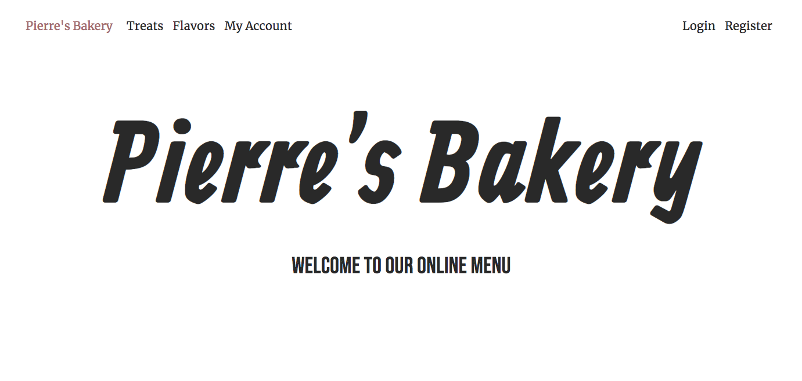
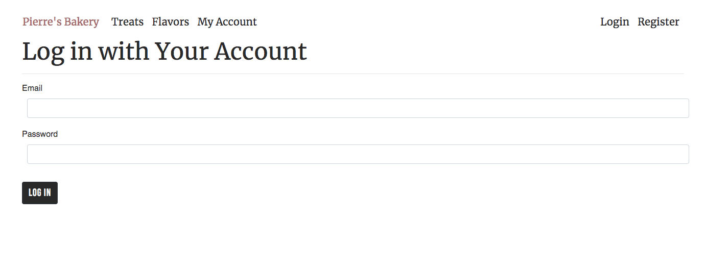

<header align="center">
  <h1>Pierre's Bakery, Treats and Flavors Manager</h1> 
  <h2>Authentication with Identity Exercise for Epicodus 08.14.2020</h2> 
  
</header> 

## Description

This week I continued to focus on databases with many-to-many relationships using SQL and Entity, and I also learned about adding authentication with Identity. This project is a C# MVC web application for Pierre's Bakery. It was built to help Pierre and his customers track the types of treats and flavors in his shop, and their relationships. This app requires the user to login to be able to create, update, and delete information about the treats and flavors.  

  

## Specifications

**Behavior**: Program will allow user to create an account
  * Input: *User clicks "Register"*
  * Output: User is taken to a page to create a username and password

**Behavior**: Program will allow user to login after registering
  * Input: *User enters login information and clicks "Login"*
  * Output: User is taken to a splash page

**Behavior**: Program will list all treats and flavors
  * Input: *User clicks on "Pierre's Bakery"*
  * Output: User is taken to a splash page with a list of all treats and flavors

**Behavior**: Program will allow user to select an treat and see all flavors associated with that particular treat
  * Input: *User clicks on specific treat*
  * Output: User is taken to a details page with flavors listed 

**Behavior**: Program will allow user to select a flavor and see all treats associated with that particular flavor
  * Input: *User clicks on specific flavor*
  * Output: User is taken to a details page with treats listed 

**Behavior**: Program will allow authticated users to add new treats
  * Input: *User clicks "Add new treat"*
  * Output: User is taken to a page with a form to add a treat

**Behavior**: Program will allow authticated users to add new flavors 
  * Input: *User clicks "Add new flavor"*
  * Output: User is taken to a page with a form to add a flavor

**Behavior**: Program will allow authticated users to add flavors to an existing treat 
  * Input: *On a treat's details page, user clicks "Add flavor"*
  * Output: User is taken to a page with a form that allows them to add a flavor for that treat

**Behavior**: Program will allow authticated users to add treats to an existing flavor 
  * Input: *On a flavor's details page, user clicks "Add treat"*
  * Output: User is taken to a page with a form that allows them to add a treat for that flavor

**Behavior**: Program will allow authticated users to remove flavors from a treat
  * Input: *User clicks "Delete" under an flavor's name on treat's details page*
  * Output: Relationship to that flavor is removed

**Behavior**: Program will allow authticated users to remove treats from a flavor
  * Input: *User clicks "Delete" under an treat's name on flavor's details page*
  * Output: Relationship to that treat is removed

## Stretch Goals
*  Create an order class, and allow users to add treats to their order

## Setup/Installation Requirements

*_These instructions are specifically for MySql Workbench, but should work similarly for or any generic SQL database manager._* 

1.  Navigate to the [Factory.Solution respository](https://github.com/kate-skorija/Factory.Solution) or open your terminal

2. Clone this project using the GitHub button or the command:
`$ git clone https://github.com/kate-skorija/Factory.Solution.git`

3. Navigate to the `Factory.Solution` directory in your editor of choice, or use [Visual Studio Code](https://code.visualstudio.com/)

4. Within the project, navigate to the Factory directory, and type `dotnet restore`, then `dotnet build`. 

5. After the build is complete, run the command `dotnet ef database update`. This will create a `bakery` database in MySql Workbench. Open or refresh MySql Workbench and confirm that the new database has been created.

7. Type `dotnet run` into the terminal. Click on the provided local host link in the terminal to view the web application in your browser. 

Note: If the application is not letting you login after registering an account, try opening the local host in a private browsing window. 

## Known Bugs

There are no known bugs at this time.

## Support and Contact Details

If there are any issues or questions, please reach out to me through [my GitHub account](https://github.com/kate-skorija).

## Technologies Used

*  [Visual Studio Code](https://code.visualstudio.com/)
*  [Markdown](https://daringfireball.net/projects/markdown/)
*  [C#](https://docs.microsoft.com/en-us/dotnet/csharp/)
*  [.NET-Core 2.2](https://dotnet.microsoft.com/download/dotnet-core/2.2)
*  [ASP.NET Core MVC](https://docs.microsoft.com/en-us/aspnet/core/mvc/overview?view=aspnetcore-3.1)
*  [SQL/MySqlWorkbench](https://docs.microsoft.com/en-us/sql/?view=sql-server-ver15)
*  [Entity](https://docs.microsoft.com/en-us/ef/)
*  [Identity](https://docs.microsoft.com/en-us/aspnet/core/security/authentication/identity?view=aspnetcore-3.1&tabs=visual-studio)

### License

*This project uses the following license: [MIT](https://opensource.org/licenses/MIT)*

Copyright (c) 2020 **_Kate Skorija_** 